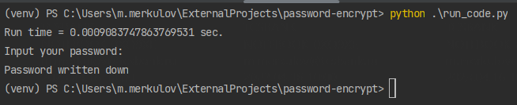

# password-encrypt

Запускать только через Terminal, т.к. "окно" для ввода скрытого пароля
доступно там, через IDE не получается.

| length  | run time |
|---------|----------|
| 100000000 |     51.304298877716064 sec.     |
| 10000000 |     3.4126954078674316 sec.     |
| 1000000 |     0.33487987518310547 sec.     |
| 100000  |0.03253030776977539 sec.|